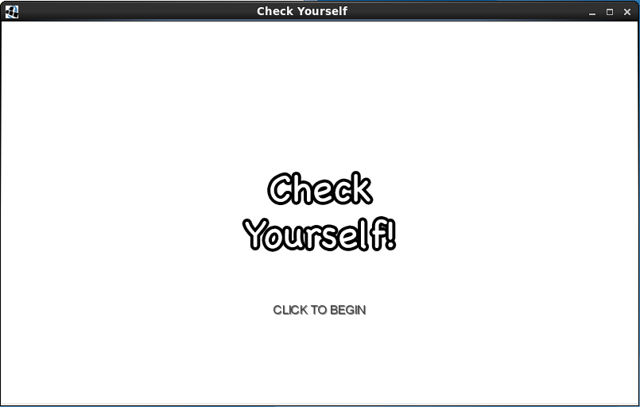
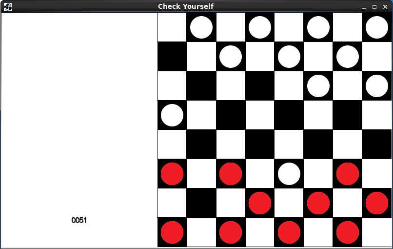
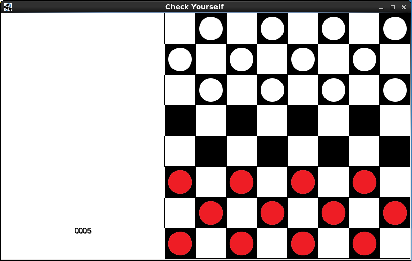

# checkyourself

Check yourself is the beginnings of a checkers game written by [Jacob
Chapman](https://github.com/jkchapman) and
[myself](https://github.com/timpeskett) in preparation for the 2016 Global
Game Jam. The main goal of creating this game was to familiarise ourselves
with libGDX, a Java game programming library.

The game as it exists now took about four hours. It is still not yet properly
playable, but is in good condition to be carried on someday and completed.

The game does enforce the 'have to take if possible' rule.  Most of the
functionality for king-ing pieces is implemented. Unfortunately, it does not
enforce turn order, which makes it somewhat unplayable as an actual checkers
game. This addition would not be too taxing, and will hopefully be made one
day when Jacob or I are motivated enough to do it.

## Roles

My role in this project was to model the behaviour of the boards and pieces. I
approached it as a task of attempting to always keep the board in a legal
state. The relevant code here is mostly in Board.java, which presents a nice
interface to the front end. Some might consider this code to be something of a
mix of controller and model code. This is not too egregious an error in such a
small game.

Jacob was responsible for the front-end here, and so became more familiar with
the libGDX specific tasks. This was very helpful for when we attended the 2016
Global Game Jam.

## Screenshots

This is the title screen of the application.

This is the board shown directly after the title screen.

This is the board position after moving a few pieces.
